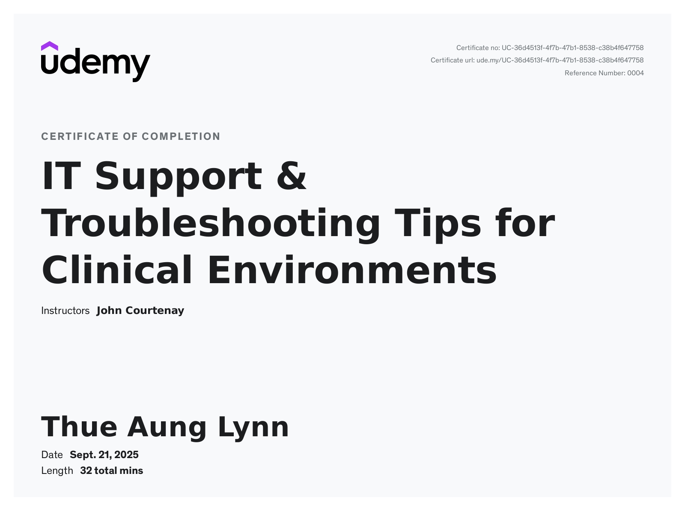
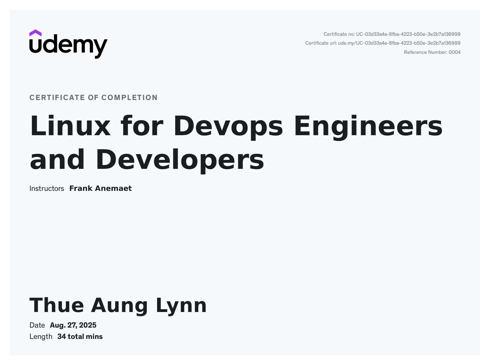

# 🔐 Cybersecurity Certificates

Welcome to my **Cybersecurity Certificates Collection**.  
This folder (`certificates/cybersecurity/`) contains all my certificates related to cybersecurity fundamentals, networking, cryptography, system administration, forensics, ethical hacking, and more.

---

## 📜 Certificate List

| Certificate | Provider / Notes | Date | Preview / File |
|---|---|---|---|
| Antivirus Basics | Cybrary | *[Add date]* | [📄 PDF](cybrary-cert-antivirus-basics.pdf) |
| Asymmetric Cryptography | Cybrary | *[Add date]* | [📄 PDF](cybrary-cert-asymmetric-cryptography.pdf) |
| Careers in Cybersecurity | Cybrary | *[Add date]* | [📄 PDF](cybrary-cert-careers-in-cybersecurity.pdf) |
| Cryptographic Hash Functions | Cybrary | *[Add date]* | [📄 PDF](cybrary-cert-cryptographic-hash-functions.pdf) |
| Cryptography Basics | Cybrary | *[Add date]* | [📄 PDF](cybrary-cert-cryptography-basics.pdf) |
| Digital Forensics Basics | Cybrary | *[Add date]* | [📄 PDF](cybrary-cert-digital-forensics-basics.pdf) |
| Firewall Basics | Cybrary | *[Add date]* | [📄 PDF](cybrary-cert-firewall-basics.pdf) |
| IP Addressing Basics | Cybrary | *[Add date]* | [📄 PDF](cybrary-cert-ip-addressing-basics.pdf) |
| Linux CLI Basics | Cybrary | *[Add date]* | [📄 PDF](cybrary-cert-linux-cli-basics.pdf) |
| Linux File-System Basics | Cybrary | *[Add date]* | [📄 PDF](cybrary-cert-linux-file-system-basics.pdf) |
| Log Analysis Basics | Cybrary | *[Add date]* | [📄 PDF](cybrary-cert-log-analysis-basics.pdf) |
| Mobile / IoT & OT Hacking | Cybrary | *[Add date]* | [📄 PDF](cybrary-cert-mobile-platform-iot-and-ot-hacking.pdf) |
| Network Device Basics | Cybrary | *[Add date]* | [📄 PDF](cybrary-cert-network-device-basics.pdf) |
| Network Fundamentals v2 | Cybrary | *[Add date]* | [📄 PDF](cybrary-cert-network-fundamentals-v2.pdf) |
| Network Reference Models | Cybrary | *[Add date]* | [📄 PDF](cybrary-cert-network-reference-models.pdf) |
| PowerShell Basics | Cybrary | *[Add date]* | [📄 PDF](cybrary-cert-powershell-basics.pdf) |
| Security Engineering & Cyber Risk | Cybrary | *[Add date]* | [📄 PDF](cybrary-cert-security-engineering-and-cyber-risk.pdf) |
| Symmetric Cryptography | Cybrary | *[Add date]* | [📄 PDF](cybrary-cert-symmetric-cryptography.pdf) |
| Web Application Hacking | Cybrary | *[Add date]* | [📄 PDF](cybrary-cert-web-application-hacking.pdf) |
| Windows CLI Basics | Cybrary | *[Add date]* | [📄 PDF](cybrary-cert-windows-cli-basics.pdf) |
| BASCS50T Certificate Photo | Burma Academy |Sept5,2024  |  |
| IT Support Certificate | — | |  |
| Linux for DevOps / Developers Certificate | — | *[Add date]* |  |

---

## 🗂️ Category Breakdown

### 🔐 Cryptography & Security Fundamentals  
- Antivirus Basics  
- Cryptography Basics  
- Symmetric Cryptography  
- Asymmetric Cryptography  
- Cryptographic Hash Functions  
- Security Engineering & Cyber Risk  

### 🌐 Networking & Network Security  
- IP Addressing Basics  
- Network Fundamentals v2  
- Network Reference Models  
- Network Device Basics  
- Firewall Basics  
- Web Application Hacking  
- Mobile / IoT & OT Hacking  

### 🐧 System & OS Security (Linux / Windows)  
- Linux CLI Basics  
- Linux File-System Basics  
- Windows CLI Basics  
- PowerShell Basics  
- IT Support & DevOps Certificate  

### 🔎 Forensics, Log Analysis & SOC Basics  
- Digital Forensics Basics  
- Log Analysis Basics  
- (plus relevant certs from above categories)  

---

## 📝 Notes

- PDF certificates are linked for download; image certificates will display a preview.  
- Filenames are exactly as they appear in the folder — do **not** rename them, unless you update the links accordingly.  
- Add completion dates in the “Date” column once verified.  
- As you upload new certificates, just add new rows to the table above.  

---

## 🎯 Purpose of This Folder

This folder (and this README) serves to:

- Document my cybersecurity learning journey  
- Organize all certifications & training materials in a single place  
- Provide a clean, professional portfolio for employers or clients  
- Demonstrate skills across networking, cryptography, system security, forensics, and web/IoT security  

---

Thank you for viewing my Crypto & Cybersecurity certification archive!  
