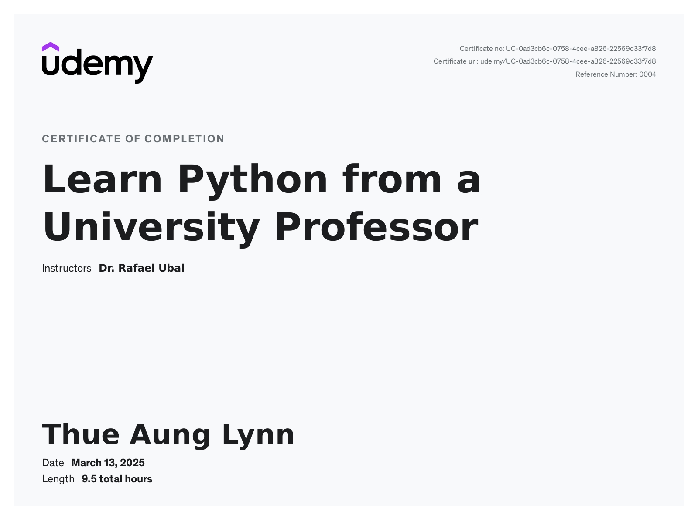
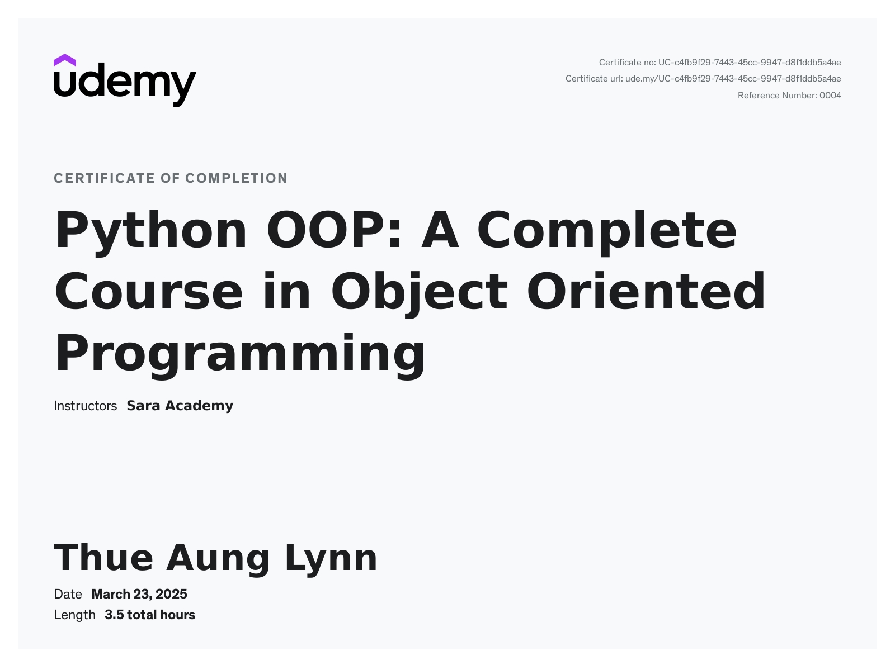

# 🐍 Python Certificates

Welcome to my **Python Certificates Collection**.  
This folder contains all certificates, courses, and achievements I have completed in Python — covering fundamentals, OOP, ethical hacking, automation, AI, and real-world project development.

---

## 📜 Certificate List

| Certificate | Provider | Date | Preview / File |
|------------|----------|------|----------------|
| Developing Ethical Hacking Tools With Python | Cybrary | *[Add date]* | [📄 PDF](cybrary-cert-developing-ethical-hacking-tools-with-python.pdf) |
| Python Basics | Cybrary | *[Add date]* | [📄 PDF](cybrary-cert-python-basics.pdf) |
| Certificate Photo | — | *[Add date]* |  |
| Learn Python from a University Professor | Online | *[Add date]* |  |
| Learn Python With 20+ Real World Projects | Online | *[Add date]* |  |
| Learn to Create AI Assistant With Python | Online | *[Add date]* |  |
| OOP Design Patterns in Python | Online | *[Add date]* |  |
| Python Development and Data Science | Online | *[Add date]* |  |
| Python Development Essentials | Online | *[Add date]* |  |
| Python Development & Programming Fundamentals | Online | *[Add date]* |  |
| Python Ethical Hacking – Pentest Scripting Basics | Online | *[Add date]* |  |
| Python Mastery – From Novice to Ninja | Online | *[Add date]* |  |
| Python OOP | Online | *[Add date]* |  |
| Social Media Bot With Python | Online | *[Add date]* |  |

---

## 🗂️ Category Breakdown

### 🔰 **Python Fundamentals**
- Python Basics  
- Python Development Essentials  
- Python Development & Programming Fundamentals  
- Python Mastery – From Novice to Ninja  
- Learn Python from a University Professor  

### 🧠 **OOP & Design**
- Python OOP  
- OOP Design Patterns in Python  

### 🛡️ **Cybersecurity & Ethical Hacking**
- Developing Ethical Hacking Tools With Python  
- Python Ethical Hacking – Pentest Scripting Basics  

### 🤖 **AI & Automation**
- Learn to Create AI Assistant With Python  
- Social Media Bot With Python  

### 📊 **Data Science**
- Python Development and Data Science  

### 🧱 **Real World Projects**
- Learn Python With 20+ Real World Projects  

---

## 📝 Notes

- PDF certificates are directly linked.
- Image certificates display a preview for quick viewing.
- Filenames are kept exactly as they exist in the folder.
- Dates can be updated anytime after you check each certificate.

---

## 🎯 Purpose of This Folder

This collection represents:

- My Python learning journey  
- My progress across different specializations  
- My hands-on practical skills in Python-based development  
- Proof of continuous growth for employers and clients  

---

